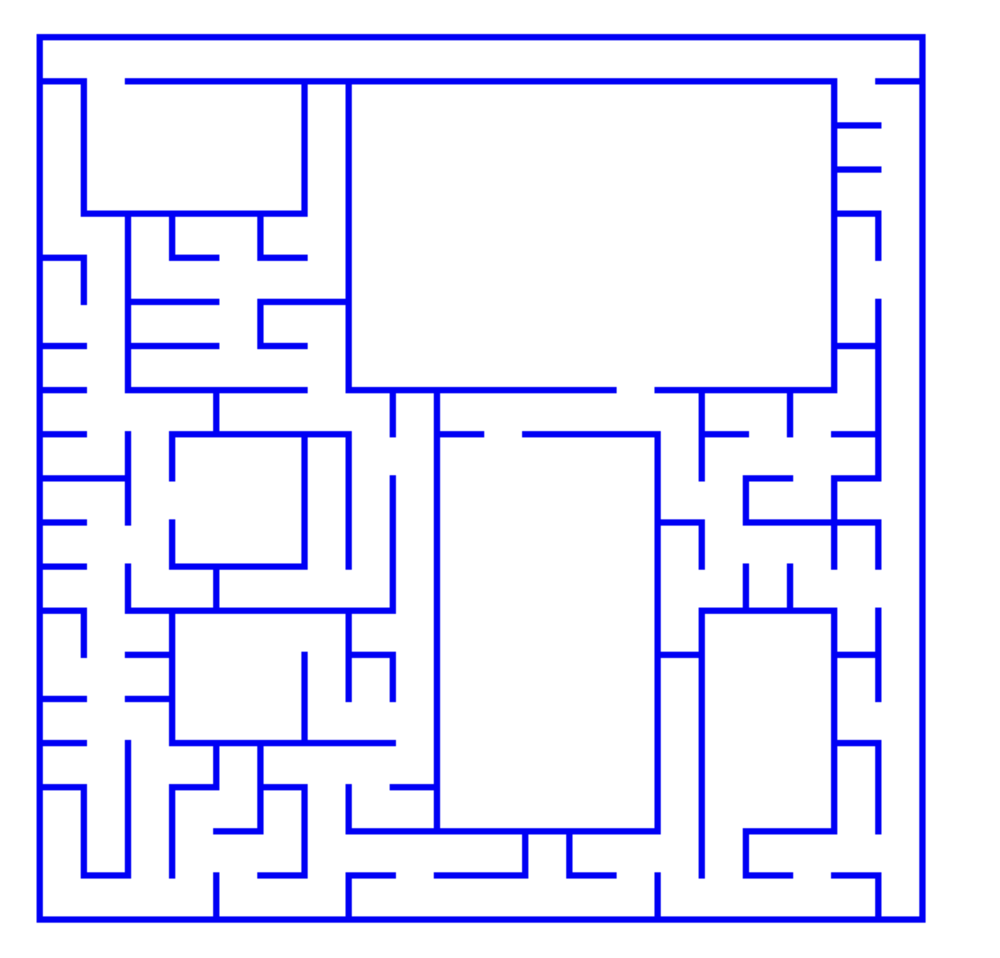
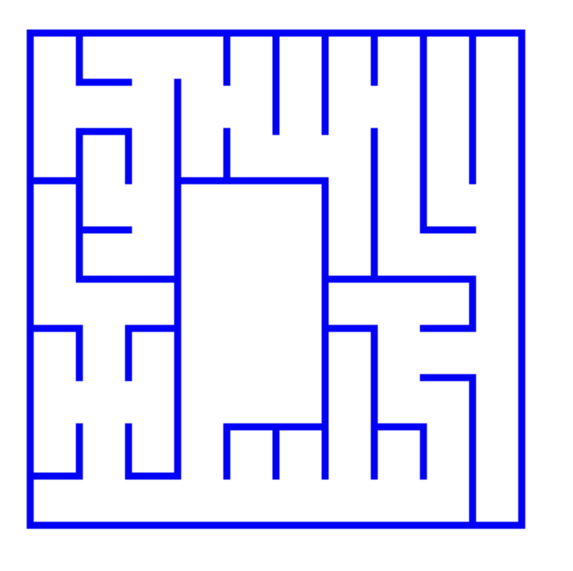
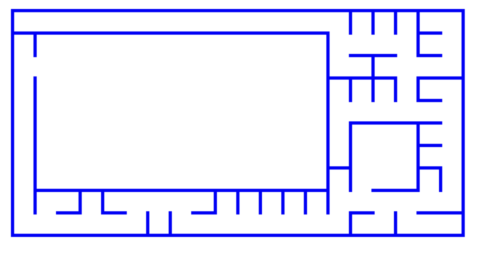

# procedural-map-generation

This project aims to generate randomized dungeon like maps procedurally for use in games.

# Build and Run

1. Clone the project.
```
git clone https://github.com/cemasma/procedural-map-generation
```

2. Install SDL2
https://wiki.libsdl.org/SDL2/Installation


3. Build the project.
```sh
mkdir build && cd build && cmake .. && make
```

4. Run the executable.
```
./procedural-map-generation 20 20
``` 
The first argument is required for the row count and the second one is for column.

# Examples
```
./procedural-map-generation 20 20
```



```
./procedural-map-generation 10 10
```


```
./procedural-map-generation 10 20
```

